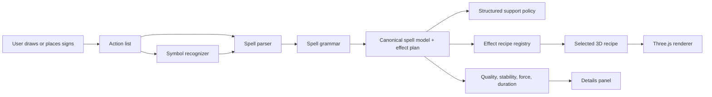
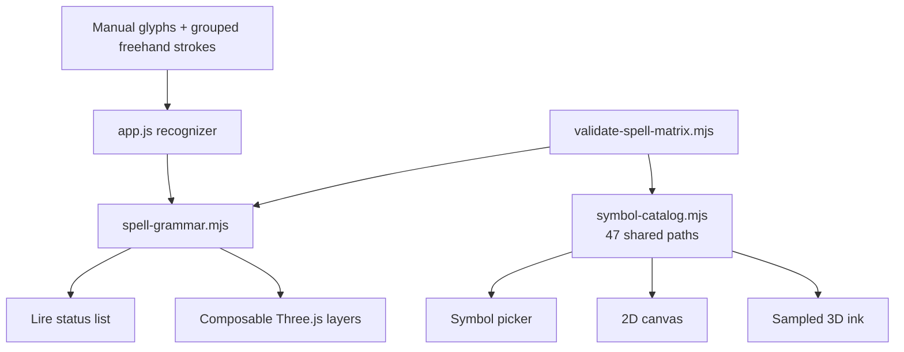

# Architecture

## Current Architecture

The app is currently a static web app:

```text
index.html          main simulator shell
styles.css          shared visual styling
app.js              UI, drawing, freehand recognition, scoring and Three.js
symbol-catalog.mjs  shared vector paths for picker, canvas and 3D ink
spell-grammar.mjs   pure sigil/sign profiles and combination engine
spell-model.mjs     canonical identity, geometry and activation snapshots
support-policy.mjs  support validation and stable effect identifiers
support-geometry.mjs grounded support poses and shoe camera
library-circle-data.mjs  33-entry public gallery inventory
scripts/validate-spell-matrix.mjs  combinatorial integrity check
bibliotheque.html   static spell library
tutoriel.html       static tutorial
parametres.html     static settings notes
```

`app.js` still owns most runtime behavior:

- Canvas drawing and hit testing.
- Freehand recognition heuristics.
- Spell scoring and spell naming.
- Three.js scene creation.
- 3D spell effect construction.
- DOM event listeners.
- PNG export and keyboard shortcuts.

Two high-risk concerns have already been extracted:

- `symbol-catalog.mjs` is the single source for all 47 visible drawings. This
  prevents the picker, placed symbol and 3D result from showing different
  shapes for the same name.
- `spell-grammar.mjs` is DOM-free. It turns sigils and signs into a deterministic
  material/effect pipeline and can be tested from Node.
- `spell-model.mjs` prevents display rounding and input order from changing a
  recipe identity, then freezes the activation payload consumed by Three.js.
- `support-policy.mjs` gives no-support and shoe-support recipes explicit,
  testable plans instead of deriving behavior from translated labels.

## Target Data Flow



## Current Module Boundary



The grammar processes these axes in a fixed order:

```text
material -> supply -> state -> form -> motion -> target -> scope -> relation -> power
```

This makes combinations additive and predictable. Stillness, for example,
freezes a manifestation after it forms instead of silently replacing its form.
An unsupported material/sign pair keeps a warning and a low confidence state.

## Later Extraction

The next extraction can remain small and practical.

```text
src-web/
  data/
    signs.js              metadata now held at the top of app.js
    spell-examples.js     library examples
  core/
    actions.js            action types and bounds helpers
    recognition.js        freehand recognition
    spell-model.js        parser and metrics around spell-grammar.mjs
  render/
    canvas2d.js           parchment rendering
    three-scene.js        camera, lights, environments
  effects/
    registry.js           maps grammar operations to visual layers
    water.js              water recipes
    fire.js               future
    wind.js               future
  ui/
    controls.js           DOM event wiring
    drawers.js            symbol/details drawers
  app.js                  bootstraps the app
```

This can still be shipped as static modules without a bundler if desired.

## Spell Model

The spell model should become an explicit object:

```json
{
  "element": "Eau",
  "boundary": {
    "closed": true,
    "rings": 1
  },
  "modifiers": ["Orbe", "Colonne"],
  "direction": {
    "x": 0,
    "y": -1,
    "label": "haut"
  },
  "metrics": {
    "quality": 92,
    "stability": 84,
    "force": 71,
    "durationMs": 13200
  },
  "effectIntent": "water.orb",
  "effectPlan": {
    "pipeline": ["matiere:water", "form:orbx1", "motion:liftx1"],
    "parameters": {
      "density": 1.16,
      "spread": 0.76,
      "lift": 0.38,
      "stability": 1
    }
  }
}
```

Benefits:

- `Lire` can display the same model the 3D renderer uses.
- Effects become testable without the DOM.
- The library can load known examples directly into the model.

## Effect Layer Contract

The current renderer composes operation layers from one `effectPlan`. A future
extraction should expose each layer through a small contract:

```js
{
  id: "form.orb",
  matchesOperation(operation) {},
  build({ THREE, scene, spellModel, drawingBounds }) {},
  update({ elapsedMs, deltaMs }) {},
  dispose() {}
}
```

Layer responsibilities:

- Add only its own meshes, particles, lights, and lines.
- Provide deterministic behavior from the spell model.
- Clean itself up when the spell ends or changes.
- Avoid touching UI state directly.

## Rendering Strategy

The Three.js renderer should stay shared. Environment and camera logic should
not be duplicated by each effect recipe.

Shared scene:

- Renderer and canvas.
- Camera and OrbitControls.
- Desk/exterior environments.
- Lighting.
- Conversion from 2D drawing coordinates to 3D positions.

Per-effect recipe:

- Element material.
- Geometry and particles.
- Phase animation.
- Effect-specific lights.

## Testing Strategy

Minimum practical tests:

- Syntax checks for JS and Python.
- Pure matrix test for all 38,532 support-aware variants: 26 profiled central
  sigils, 741 unordered sign pairs and 2 support modes.
- Shared-drawing test for all 64 sigils/signs.
- Determinism and finite-parameter assertions for every effect plan.
- Browser smoke test for the main simulator.
- Canvas nonblank check after drawing and activation.
- Screenshot checks at desktop and mobile sizes.

## Deployment

Current deployment can remain static:

- `index.html`
- `styles.css`
- `app.js`
- `symbol-catalog.mjs`
- `spell-grammar.mjs`
- `variant-catalog.mjs`
- `variant-index-worker.mjs`
- `library-explorer.mjs`
- documentation and static pages

For stronger releases:

- Pin Three.js through local files or a package lock.
- Add a simple build/check script.
- Keep private reference images out of the deployed artifact.
