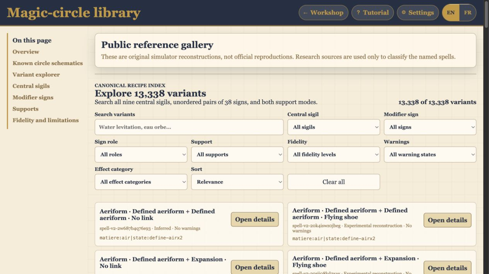
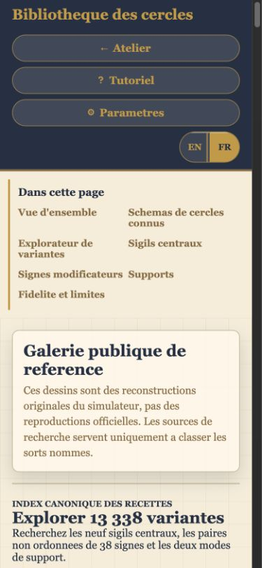
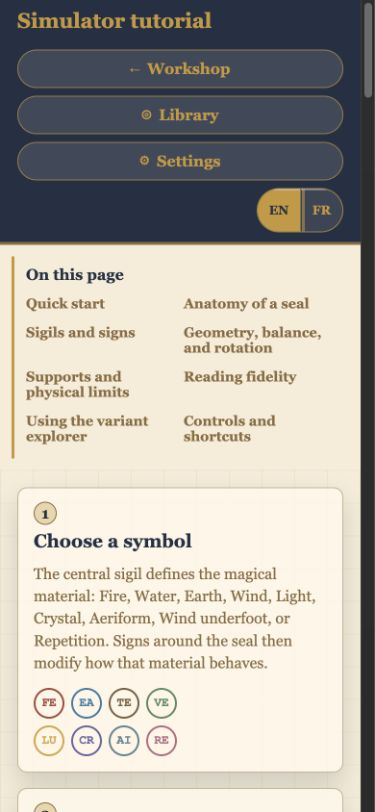
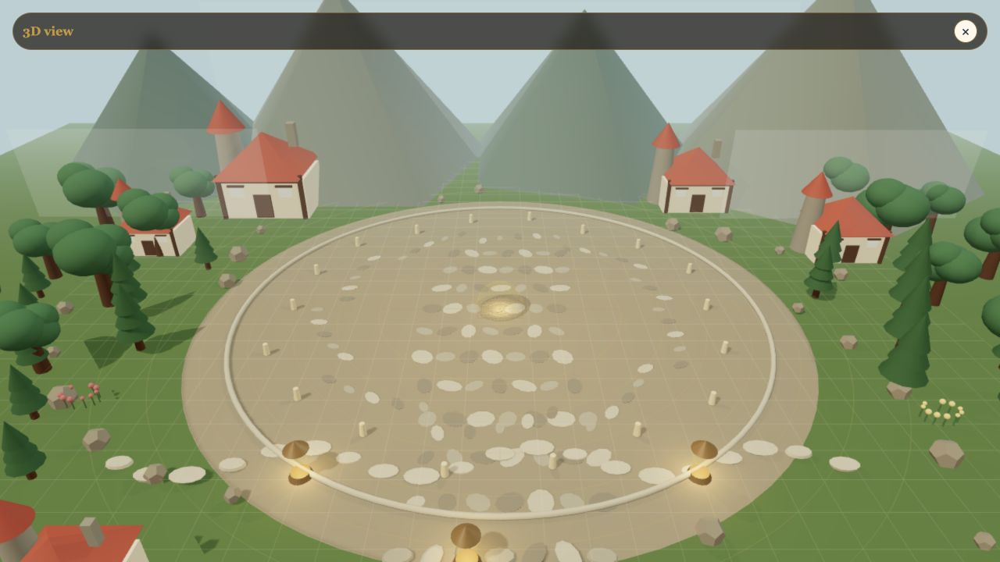

# Canonical Wiki Release QA Results

Date: 2026-07-16

## Automated Verification

- JavaScript syntax checks passed for the workshop, symbol catalog, grammar,
  explorer catalog, explorer UI, worker and release scripts.
- Test suite: 89 passed, 0 failed.
- Matrix: 13,338 tested, unique and deterministic variants.
- Support split: 6,669 paper-only and 6,669 shoe variants.
- Catalog: 9 indexed central sigils, 38 signs and 64 shared drawings.
- Semantic checks: 19 passed.
- Distinct executable plans: 12,288.
- Security audit passed: CSP, credentials, dynamic execution, remote scripts,
  external links and the vendored Three.js license were checked.
- The simulated GitHub Pages artifact passed: required runtime files were
  present and private reference material was absent.
- `git diff --check` passed.

## Browser Verification

The final worktree was served at `http://127.0.0.1:8010/` for isolated testing.

### Library, 1280 x 720, English

- Exactly 13,338 variants reported and 50 recipe cards rendered per page.
- Flexible search for `water levitation` returned 76 recipes.
- Adding the shoe filter returned 38 recipes and updated the shareable URL.
- Recipe details opened with translated fidelity and combined-effect labels.
- All 33 schematic images loaded with non-zero dimensions.
- No horizontal overflow, leaked translation keys, console warnings or errors.

### Library, 390 x 844, French

- All 33 schematics loaded and 50 recipe cards rendered.
- Wiki navigation, filters and bilingual control stayed inside the viewport.
- No horizontal overflow or leaked translation keys.

### Tutorial, 390 x 844, English

- Eight stable wiki anchors were present.
- The 13,338-variant formula and direct explorer link were visible.
- Twenty instructional headings rendered without overflow or untranslated keys.

### Workshop And 3D Activation, 1280 x 720, English

- The drawing canvas opened centered with no support selected by default.
- A 47 cm raw-energy ring was read and activated.
- The 3D canvas opened at 1280 x 720 with a visibly nonblank environment and
  manifestation, then stopped when the three-second spell ended.
- No horizontal overflow, leaked translation keys, console warnings or errors.

## Release Decision

The canonical build satisfies the automated, browser and deployment gates.
Commit `7c11b9d` deployed successfully through GitHub Actions run `29522358568`.
The root page, library, tutorial, settings, explorer catalog, worker and a sample
SVG all returned HTTP 200 from the final Pages URL. The historical site serves
verified redirects and its repository is archived.

- Repository: `NH1980MG/witch-hat-atelier-spell-simulator`
- Site: `https://nh1980mg.github.io/witch-hat-atelier-spell-simulator/`
